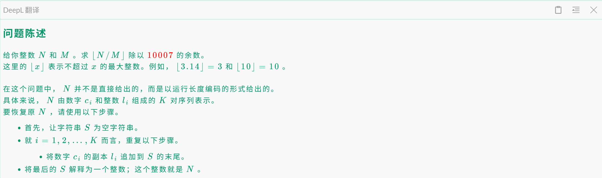

[TOC]


# 数学

## 欧几里得距离

$$
d((x_1,y_1),(x_2,y_2))=\sqrt{(x_1-x_2)^2 + (y_1-y_2)^2}
$$

## 曼哈顿距离

设两点：

$$
(x_1, y_1), (x_2, y_2)
$$

则有
$$
d((x_1,y_1),(x_2,y_2))=|x_1 - x_2| + |y_1 - y_2|
$$


**对于曼哈顿距离，我们可以将其旋转45°，转化为切比雪夫距离，令u=x+y,v=x-y, 则** 
$$
d((x_1,y_1),(x_2,y_2))=max(|u_1-u_2|,|v_1-v_2|)
$$


https://atcoder.jp/contests/abc178/tasks/abc178_e?utm_source=chatgpt.com

这里，我们只需要维护4个量即可  max_u,min_u,max_v,min_v, 于是，我们即可实现O(n)遍历

```c++
void solve() {
    int n;
    cin>>n;
    vector<pair<i64,i64>> a(n);
    for(int i=0;i<n;i++) {
        i64 x,y;
        cin>>x>>y;
        a[i]={x+y,x-y};
    }

    i64 minu=infl,minv=infl,maxu=-infl,maxv=-infl;
    for (auto [u,v] : a) {
        minu=min(minu,u);
        minv=min(minv,v);
        maxu=max(maxu,u);
        maxv=max(maxv,v);
    }

    i64 ans=max(maxu-minu,maxv-minv);
    cout<<ans<<'\n';
}
```


## 切比雪夫距离

$$
d((x_1,y_1),(x_2,y_2))=\max(|x_1-x_2|, |y_1-y_2|)
$$


# 数论

## 取模

### 数字拼接分治

https://atcoder.jp/contests/abc448/tasks/abc448_e



* 补充一下题目，是添加 l 个 c ；


用到的结论：

```c++
(x % P - y % P) % P = (x - y) % P;
(x % P + y % P) % P = (x + y) % P
    
(a % M - b) % M = (a - b) % M    
(a - b % M) % M = (a - b) % M

(a + xM) % M = a % M
```


* 这里的 n/m = (n-n%m)/m;  于是我们这里需要维护 %m 和 %M 两个量，最后用 x = (rM-rm+m)/m ，然后我们再进行逆元， ans = x * qpow ( m,M-2,M)%M;
* 好了，维护阶段：其实就是等比数列求和
  * 首先想到公式：d*(10^l-1)/9，但是不能这么算，因为需要的是取模后的结果，%m和%M取模后不一定能/9 ，（因为m和9不一定互质），（我们所学的高中公式是必须要能 /9 的），（总之，有除法和模的结合就得注意）
  * 于是我们换一个方法，类似快速幂


O(n log n)

```c++
constexpr int M=1e4+7;
i64 qpow(i64 a,i64 b,i64 p)  {//求a的b次幂
    i64 ans=1,base=a;
    while  (b)  {
        if  (b&1)  {//可以理解成一次搞出二个
            ans=(ans*base)%p ;
        }
        base=(base*base)%p;
        b>>=1;
    }
    return ans;
}

i64 cal(i64 d,i64 l,i64 P) {
    if (l==1) return d;
    if (l&1) return (cal(d,l-1,P)*10+d)%P;
    i64 v=cal(d,l/2,P);
    return v*(1+qpow(10,l/2,P))%P;
}

void solve() {
    i64 k,m;
    cin>>k>>m;

    i64 rM=0,rm=0;
    for (int i=1;i<=k;i++) {
        i64 d,l;
        cin>>d>>l;
        rM=rM*qpow(10,l,M)%M;
        rm=rm*qpow(10,l,m)%m;
        rM=(rM+cal(d,l,M))%M;
        rm=(rm+cal(d,l,m))%m;
    }

    rM=(rM-rm+M)%M;
    rM=rM*qpow(m,M-2,M)%M;
    cout<<rM<<'\n';
}
```

