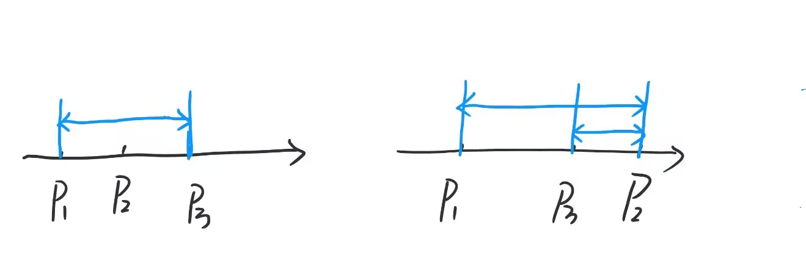
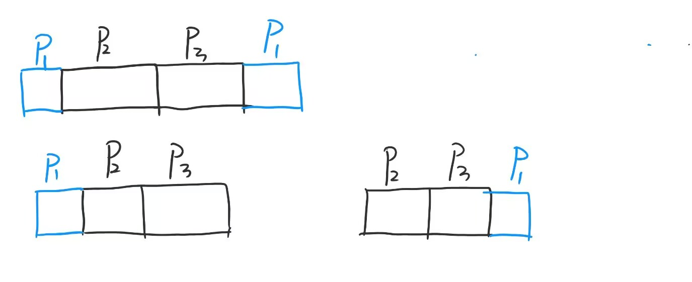

# 构造


[TOC]

# 指南

> 摘自知乎

> 以思维题为主，不太涉及算法，虽然跟其他几个list有交集，但

> 写这些东西，不能只局限于这道题目，一定要深挖背后的思想，简化题目，归到一般化经典模型，从根本思考，这样下次才能利用这种思想轻松转化


> 

1.交替排列

* 需要间隔满足条件/相邻元素不同/棋盘格效果
* （1）奇偶位置不同值
  （2）ABABAB
  （3）正负交替

2.对称构造

* 回文/对称/中心扩展

* (1)回文数组
  (2)对称矩阵
  (3)中心对称

  

3.极值分配

* 最大值配最小值/平衡分配/两极配对
* (1)最大最小配对
  (2)大小间隔排列
  (3)平衡权重


4.增量构造

* 等差数列/等比数列/固定步长增长
* (1)2的幂次
  (2)固定差值递增
  (3)斐波那契类


5.模运算循环

* 按余数分组/循环出现/周期规律
* (1)按模k分类
  (2)循环填充
  (3)余数决定类型


6.二进制位

* 位运算/2的幂/异或性质
* (1)位掩码构造
  (2)异或为0
  (3)2的幂组合

7.贪心极值

* 全部取max,min/极端情况/边界测试
* (1)全1序列
  (2)全max
  (3)单一不同值


8.循环移位

* 轮转/循环移动/环形结构
* (1)左移/右移
  (2)循环排列
  (3)环形数组

9.前缀和/差分

* 区间和/增量操作/差分数组
* (1)固定区间和
  (2)递增序列
  (3)差分约束

10.随机化，概率

* 概率/随机排列/shuffle
* (1)随机排列
  (2)概率构造
  (3)多次尝试


# 构造

## 周期数列

[问题 - B - Codeforces --- Problem - B - Codeforces](https://codeforces.com/contest/1348/problem/B)

* 尝试发现


这个必是个由周期数列重复形成的b,  那么如果a中的不同数字数量cnt>k,必定不可以，我们只需构造一个长度为k的数列，（cnt<k的1填后面补全），重复n次即可


## 等差数列

[Problem - 1788C - Codeforces](https://codeforces.com/problemset/problem/1788/C)

* 首先我们先写出式子，得到等差的第一个和为sum=3*(n+1)/2; 所以n为奇数才合法
* 构造等差：  以n=9为例，sum=15;  

把小于n的奇数和偶数分开

左边+2，右边-1

1,14

3,13

5,12

7,11

偶数右侧的第一个数由sum得出，sum得维护

2,17

4,16

6,15

8,14


## 奇偶

[Problem - 1463B - Codeforces](https://codeforces.com/problemset/problem/1463/B)

* 注意到，这种左一下，右一下的，我们可以分奇偶讨论 1,a[i],1,a[i].....   还有   a[i],1 ,a[i] , 1....可以先满足一个条件
* 然后还有条件3，我们先算出a中的   sumodd   ,   sumeven,这里肯定有一个会<sum/2,我们只需挑小的那个，如：sumodd,  就是说偶数会更大，那偶数位置不换，还是自己，奇数换成1


## 单调数组

https://codeforces.com/problemset/problem/1854/A1

* 如果 a[i] <0 （全部） 那么cnt=n-1, 从后开始遍历，一直让a[i]+=a[i+1] ,也就是加上后缀和（负的）
* 那么先找到某个 a[i]>0 , 然后对 a[i], a[i] 操作5次后， a[i]>50, 然后从2开始遍历，操作（2,pos)两次，其余均为  (i,i-1) 两次, 每次操作后都会使得a[i] max


## 回文

https://codeforces.com/contest/2162/problem/E

* 首先我们不要想放k个，先想3个（因为1，2是不可能的）， x , y , z ,这3个数循环下去，不会增加回文（仅这3个时）
  * 接下来我们想，如果所给 a 是1个排列，那么我们这3个数直接用a的前3个即可
  * x=未出现的;    y != x  ,   y ! = a[n] , 因为这里我们考虑到k=2时，以及a[n],a[0],a[1] 不能新增回文，然后我们令 z = a[n] 


## Good

[Problem - 1355D - Codeforces](https://codeforces.com/problemset/problem/1355/D)

* 证明的话现在水平有限，以后再搞

* 首先我们把前n-1个元素都设置为1，a[n]=s-(n-1)，易知，可达的k : 前n-1个：1~n-1, 从最后1个到第一个：

​     s-(n-1)~s,  这里我们如果输，那就是刚刚我们得到的两个区间无交集且中间至少空了1个元素， 

列式子:  s-(n-1) > (n-1)+1 , 即 s >= 2n 时，必胜，否则败


https://codeforces.com/problemset/problem/1927/E

* 把它当成一个长度为k的滑动窗口，一直在移动，而且每次进来与出去的差值规律为： +1,-1,+1,-1 （注意到这是2循环改变，所以可以奇偶来搞）
* 于是我们发现对于 i,i+k,i+2k,i+3k ,......这些都是连续且单调的，那么我们不妨按这样的顺序填数，奇数位的这些为-1，偶数位为+1，（当然也可以反过来）
* 注意单调递减的那个得从后往前遍历才好搞（得先算出极限位）

```c++
    int cur=0;
    for (int i=1;i<=k;i++) {
        if (i%2==0) {
            for (int j=i;j<=n;j+=k) {
                a[j]=++cur;
            }
        }else {
            int j=i;
            while (j<=n) j+=k;
            for (int l=j;l>=i;l-=k) {
                if (l>n) continue;
                a[l]=++cur;
            }
        }
    }
```


# 排序

[Problem - 1537C - Codeforces](https://codeforces.com/problemset/problem/1537/C)

aaaxybbb ---> 

ybbbaaax   从而实现 n-2对，若只有2个数，可实现n-1对


## 之字形

[Problem - 1339B - Codeforces](https://codeforces.com/problemset/problem/1339/B)

1 2 3 4 5 6 7 8 9

先顺排n/2个大数，再倒序插入小数

   6   7   8   9

 5   4   3   2   1

```c++
    vector<int> a(n+1);
    for (int i=1;i<=n;i++) {
        cin>>a[i];
    }
    sort(a.begin()+1,a.end());
    vector<int> b{0};
    for (int i=n-n/2+1;i<=n;i++) {
        b.emplace_back(a[i]);
    }

    int l=n-n/2,r=1;
    for (int i=1;i<=n;i++) {
        if (i&1) {
            cout<<a[l--]<<" ";
        }else {
           cout<<b[r++]<<" ";
        }
    }
```


## 交错排序

### 1，-1型

[Problem - 1990B - Codeforces](https://codeforces.com/problemset/problem/1990/B)

> x+1到n :   a[x]    -1  1  -1  1  -1  1  -1......
>
> 1到y-1  :  ......1 -1  1  -1  1  -1   a[y]


## 循环排序

[Problem - 2118B - Codeforces](https://codeforces.com/problemset/problem/2118/B)

循环移位

*  i :  1  i

​              i+1    n

* 最后i=n时  ： 1  n


## 模拟

[Problem - 1674D - Codeforces](https://codeforces.com/problemset/problem/1674/D)

> 注意到，a[n],a[n-1]必在b[1],b[n],(顺序自定)，b[1],b[n]必在c[n-1],c[n],(顺序自定)，
>
> 由此类推，(a[n],a[n-1]),(a[n-2],a[n-3])......两两组合，顺序自定，因此，只需在两两组合swap,
>
> 然后与升序的重排数组d比较即可


## 好题

[F-琪露诺的排列构造_牛客小白月赛125](https://ac.nowcoder.com/acm/contest/125080/F)

对于n<=2，no

n为奇数，2,3,4,5,6,1

n为偶数，2，4，1，3 可以从这个找到规律

2，3，4，6，1，5   前n-3项与n奇一样，后3项，n,1,n-1


[Problem - B - Codeforces](https://codeforces.com/contest/1928/problem/B)

首先，重复的元素out，先来个sort,unique,erase

我们对于一个合法区间，必须满足max-min<=n-1,你想，不妨令max元素+1，这个差值就是min元素要比max元素多加的值了，以此类推到该合法区间的任意元素


[Problem - 1772D - Codeforces](https://codeforces.com/problemset/problem/1772/D)

* 首先考虑x的 范围对排序的影响
  * 首先a[i]=a[i+1] 时，x任取
  * a[i]<a[i+1] 时，x<=(a[i]+a[i+1])/2;          mx
  * a[i]>a[i+1] 时，x>=(a[i]+a[i+1]+1)/2;      mn

* 分别对这两种数组不断取min,max，然后看看mn>mx则不可行，否则ok


https://codeforces.com/problemset/problem/1838/C

* 对于1~n*m 的那种正序，差值只有1,m,因此得考虑行差
* 把1~ n/2分配给偶数行，其他给奇数行，（调过来不行，因为这是为了避免 n/2,n/2+1的冲突）


## 博弈贪心

https://codeforces.com/problemset/problem/1740/C

* 对于含绝对值的题，我们可以放到数轴上分析



* 先排序
* 显然对放包者来说，图二更优，于是对于放包者来说应使得 p2>max(p1,p3) 或p2<min(p1,p3)；而拿包者显然应尽量选紧挨着p1或p3的p2，可是这样还不够（复杂度显然O(n*n)) ,
* 进一步分析，我们现在可以把p1,p2,p3理解成块来分析



显然下面两个会更优，因为对于图一来说，最终选定的p1要么是左要么是右，那么对于放包者来说，显然把p2/p3弄到边界是更优的

于是我们有n*log n 的做法，其实就是枚举块的端点

```c++
    vector<i64> a(n+1);
    for(int i=1;i<=n;i++) cin>>a[i];
    sort(a.begin()+1,a.end());

    i64 ans=0;
    for (int i=3;i<=n;i++) {
        ans=max(ans,a[i]-a[1]+a[i]-a[i-1]);
    }

    for (int i=1;i<=n-2;i++) {
        ans=max(ans,a[i+1]-a[i]+a[n]-a[i]);
    }
```


## 分段排序

https://codeforces.com/problemset/problem/1896/C

我们分别将a,b排序， 我们可以这样贪心：把b前x小的都对应到a的后x大 ，这样交替的分段排序

a :  1 2 3 4 5 . . . x  x+1.... n

b:  x+1  x+2,.....,1,2,3,...x


实现的话，这种思路挺不错的

```c++
void solve() {
    int n,x;
    cin>>n>>x;
    vector<int> a(n),b(n);
    for (int i=0;i<n;i++) cin>>a[i];
    for (int i=0;i<n;i++) cin>>b[i];

    vector<int> pa(n),pb(n);
    iota(pa.begin(),pa.end(),0);
    iota(pb.begin(),pb.end(),0);
    sort(pa.begin(),pa.end(),[&](int i,int j){return a[i]<a[j];});
    sort(pb.begin(),pb.end(),[&](int i,int j){return b[i]<b[j];});

    vector<int> ans(n);
    for (int i=0;i<n;i++) {
        ans[pa[i]]=b[pb[(i+x)%n]];
    }

    int cnt=0;
    for (int i=0;i<n;i++) {
        if (a[i]>ans[i]) cnt++;
    }

    if (cnt!=x) {
        cout<<"NO\n";
        return;
    }

    cout<<"YES\n";
    for (int i=0;i<n;i++) {
        cout<<ans[i]<<" \n"[i==n-1];
    }
}
```


# 双指针


## 边界判断与更新

[Problem - 1793C - Codeforces](https://codeforces.com/problemset/problem/1793/C)


>  用双指针不断判断两端是否为`mx,mn`,
>
> `yes`:继续走，并更新`mn++,mx--;`
>
> `no:ok`


## 可行区间

遇到合法区间之类的就用枚举断点法，交叉关系的就想办法单向

[Problem - 1771B - Codeforces](https://codeforces.com/problemset/problem/1771/B)

* 先连边，单向两边就是一对陌生人中, x<y,  adj[y].push_back(x); 

* 然后枚举右端点，内层循环用 int v: adj[y] 的端点的max,j，ans+=i-j, 注意了，这个j具有继承性，就是你枚的下一个右端点的时候，上一轮的j继承下来，因为上一轮保证了那个合法区间，你右端点右移其实就是加人，前面已合法，做的判断就是新点加进来的影响


# 匹配

>  先排序，大数优先处理，x/=2，需要a(n)中每个数都产生一个1到n的数，若两个数都能产生同一个数y，则他俩都能产生y/=2之后的，但鉴于大数能产生更多数，因此大数优先


# 前缀后缀

[Problem - C - Codeforces](https://codeforces.com/contest/2064/problem/C)

对于这些数，我们总会取一些正数构成的前缀和及负数构成的后缀和，就是说（按顺序的表示你最终选的情况）你不会+-+-+-,因为这样你最多只能选2次，所以只能++++-----,+++++,-----,因此我们只需要枚举分法（即最后一次选+的位置）,O(n),可以通过


# 数学

## 组合数学

[Problem - 1862D - Codeforces](https://codeforces.com/problemset/problem/1862/D)

* 注意了，这里是精确的n种，别忘了同类型的雪球也算1种，这里我们用二分查找找到<=n的  k*(k-1)/2;

  然后不够的用1种类型的来补 ans=k+n-k*(k-1)/2;

  因为贪心，先选不同的总比选相同的划算，记得二分时r=sqrt(2*n)+1,否则容易溢出


## 找规律（贪心）

### 好题

[D-⑨运算(Easy Version)_牛客小白月赛125](https://ac.nowcoder.com/acm/contest/125080/D)

写构造题一定要先打表找规律，

考虑直接将x变为>=x的min999

(1). x%9==0,就可以直接+9 ,

(2). x%9!=0,那就必须要有*的操作了（当然x%9==0也可以尝试这一步，最后取min即可）

​     将x变为离他最近的111,可能只能变到103，104之类的，但没关系，(千万不能超过，否则*9就会超过min999)

​     接着*9,再+9直到变为999


我对%9的理解是，前部分+9后，再*9,与`111*9`,相差了`(tp%9)*9`


*  必须是因为最后的数要 %9==0,狂+9无法实现

  

```c++
void solve() {
    i64 x;
    cin>>x;

    i64 t1=0,t9=0;
    i64 y=x;
    while (y) {
        t1=t1*10+1;
        t9=t9*10+9;
        y/=10;
    }
    if (x>t1) t1=t1*10+1;

    i64 ans=inf1;
    if (x%9==0) ans=min(ans,(t9-x)/9);

    i64 tp=t1-x;
    ans=min(ans,tp/9+tp%9+1);//tp/9是前部分+9的cnt,tp%9是后部分+9的cnt,在中间*9
    cout<<ans<<'\n';

}
```


## 奇偶分析

### 分讨

[Problem - 1497C1 - Codeforces](https://codeforces.com/problemset/problem/1497/C1)

> 这里对n的奇偶性分析：
>
> (1) 奇：1,n/2,n/2
>
> (2) 偶 :分n%4两类讨论，第二类: `2,n/2/2*2,n/2/2*2`
>


[Problem - 2092C - Codeforces](https://codeforces.com/problemset/problem/2092/C)

> 我本来是先特判，再分mx奇偶讨论，
>
> （1）奇：all偶-1（为了转变性质），然后每1个奇就得-1，除了最后1个
>
> （2）偶：all奇-cntji+1(为了转),all偶
>
> 然后发现二者可以合并：all偶+all奇-cntji+1

> 其实换一种思路：all偶全到1个奇上，然后其余的奇-1，给到所谓的0上
>
> 因为就是想要偶嘛


### 下除

https://codeforces.com/problemset/problem/1901/C

* 我们先对a进行排序,操作并不会改变排序,于是我们只需令最小值=最大值即可
* (mn+x)/2,  (mx+x)/2;  假设这里可以整除(先不考虑要向下), 那么 t=(mx+x)/2-(mn+x)/2 = (mx-mn)/2, 与x无关,
  * 当mn,mx 为偶数时,我们选x=0,
  * 当mn,mx为奇数时, x=1
  * 对于一奇一偶的情况,打表可知, mn奇数: x=1(减得少) ,mn偶数: x=0, 为最优策略  ,(不能用mx判断,因为mx会面临mx=1,可能多次操作永远为1,的情况)


## 位运算

### 格雷码

  格雷码是一种**循环二进制码**，其核心特征是：**任意两个相邻的数值，它们的二进制表示中只有一位不同。**


https://ac.nowcoder.com/acm/contest/120564/C

```c++
void solve() {
    int n;
    cin>>n;

    for (int i=0;i<(1<<n);i++) {
        cout<<(i^(i>>1))<<" ";
    }
    cout<<'\n';
}
```


### ^ 

#### 前缀异或

* 子段异或问题，使用前缀异或很有用


[Problem - B - Codeforces](https://codeforces.com/contest/2175/problem/B)

> 构造pre[i]=i,pre[r]=pre[l-1];
>
> a[i]=pre[i]^pre[i-1];


#### 贪心

##### 从高位到低位

[Problem - C - Codeforces](https://codeforces.com/contest/2180/problem/C)

* 感觉遇到这种位运算的题，要按位分析

* 对于k为偶数，从n的高位到低位分析，如果当前位是1，那么接下来必然有一个数在这个位0，顶不到上界，如果当前位为0，那就让所有顶不到上界偶数个数在这个位上=1（千万不能要顶到上界的在这个位上=1，会ai>n）

* 为1时，每次让一个顶到上界的变为没顶到上界的就行了

  

```c++
    vector<int> a(n+1);
    int p=0;//有多少个数顶到了上界
    for (int i=30;i>=0;i--) {
        if ((n>>i)&1) {
            if (p<k) p++;
            for (int j=1;j<=k;j++) {
                if (j==p) continue;
                a[j]+=(1<<i);
            }
        }else {
            for (int j=1;j<=p/2*2;j++) {
                a[j]+=(1<<i);
            }
        }
    }

```


##### 优先处理，延后无益

[D-小苯的01合并_牛客周赛 Round 125](https://ac.nowcoder.com/acm/contest/126319/D)

* 通过任意次相邻异或（a长度-1）把a变成b,  首先如果a的所有异或不等于b，NO
* 为什么及时贪心是对的？ 因为但凡你通过直接或异或匹配到二者，记a[pos]，如果你想延后，那么pos+1到你的预期位置（即你下一个目标匹配的前一个a[i]）异或总和必须=0，还不如优先处理，这样可以给后面更多的操作空间
* 记得处理尾巴


##### 好题

[Problem - C - Codeforces](https://codeforces.com/contest/2119/problem/C)

* 观察样例即可得出构造方法，奇数easy,偶数的话
* 考虑按位分析，打表把1，0的& ^全写出来，然后发现只有0&0=0^0,
  * 对于&该位全为1才为1，对于^得有奇数个1，看来只能全部位为0了
  * 首先前n-2个为l,后两个都为比l高一位的其他位都=0的
  * k=2----> -1


[Problem - C - Codeforces](https://codeforces.com/contest/2118/problem/C)

* 只需要统计每个数的每位中位0，1的即可，然后从低位遍历cnt0,k-代价


https://codeforces.com/contest/2189/problem/C1

* 这里注意到对于偶数 x 而言  x^(x+1)=1 
* 第1，n 位随意，因此我们可以把1放到最后一位，然后两位的偶奇互换
  *  对于偶数： 6 ,[3，2]，[5，4]，1
  * 对于奇数：  6 ，[3，2]，[5，4]，7，1
* 实现的话可以注意到这很像二叉树的交换，于是  中间位：i^1;


https://codeforces.com/contest/2189/problem/C2

* 这是困难版，对于奇数，我们的策略不变

* 对于偶数：

  * 如果n是2的幂，那么--> -1，因为n无论^谁都会变得比n大

  * 那么对于其他的，我们考虑在简单版的基础上修改，关键在a[1]=n这里得换，把**n换到下标为2的幂的位置**上是最简单的

    * 这样可以在把n 异或小的同时，在后面也能找到答案

    * 而换过来的必定是不等于1的奇数，合法的（可以在后面找到答案）
    * 那么我们需要做的就是找到n的最低位的1（这最简单）


### | 

> &可以把都没有的位关上

[Problem - B - Codeforces](https://codeforces.com/contest/1903/problem/B)

首先我们把a[i]的所有位都打开，(1ll<<30)-1,然后根据 `a[i]&=m[i][j]`,把`m[i][j]`没有的位关上

最后检验`m[i][j]=a[i]|a[j]`即可

由于n<1e3,时间复杂度为O(n²)


[Problem - 1988C - Codeforces](https://codeforces.com/problemset/problem/1988/C)

按位贪心，从低位开始，逐渐让n中为1的位变为1，直到到达最高位，记住下一个得还原为n再变


[Problem - 1775B - Codeforces](https://codeforces.com/problemset/problem/1775/B)

* | 的并集思想体现在这里，第一个f(a)全上，扫一遍，用map记录vis[i]的出现次数，

  然后再扫一遍看看有没有一组是满足全部元素vis>=2的


### & 

[Problem - D - Codeforces](https://codeforces.com/contest/2179/problem/D)


* **贪心**

* 不要以为

  11111

  01111

  00111

  00011

  00001

  00000

  实际上的贪心

  11111

  01111

  00111

  10111

  00011

  01011

  10011

  11011

  00001

  00101

  ......

  关键是怎么写，用&就是还是有那么多位

```c++
void solve() {
    int n;
    cin>>n;

    map<i64,i64> vis;
    for (int i=n;i>=0;i--) {
        i64 x=1ll<<i;
        x--;
        cout<<x<<" ";
        vis[x]=1;
        if (i>0) {
            i64 y=1ll<<(i-1);
            for (i64 j=y+1;j<(1ll<<n);j++) {
                if ((j&x)==x&&!vis[j]) {
                    cout<<j<<" ";
                    vis[j]=1;
                }
            }
        }
    }

    for (i64 i=1;i<(1ll<<n);i++) {
        if (!vis[i]) {
            cout<<i<<" ";
        }
    }
    cout<<'\n';

}

```


[Problem - 1513B - Codeforces](https://codeforces.com/problemset/problem/1513/B)

* **全体**

* 首先得明确&只会变小，然后 x&x=x

*   先分析条件1： 

   x | [ ] [ ] [ ]     注意到前面的&与后面的&=， 我们不妨在后面& x,  那么就是说  x=全体&

  [ ] [ ] [ ] | x  这里的尾端位置同理，

  那中间就可以随便填了，因为首尾必为全体&,于是中间无论怎么填两部分的&都为全体&


### 好题

[Problem - 1909B - Codeforces](https://codeforces.com/problemset/problem/1909/B)


> 易知，对于含奇偶的用2处理，其他的可以将借助二进制思想，全偶/奇必定末位相同，
>
> 向左走，只需找到能出现两个不同的块即为k,走j步,k=1<<j


[Problem - D - Codeforces](https://codeforces.com/contest/2184/problem/D)

先手玩几下找到规律

* 我们的走法是用二进制分析，首先1000，需要4步，另外：111-->110-->11-->10-->1-->0

* 步数=位数+有多少个1（除去最高位的1）

* 比如10000(二进制)，k=5时，那至少要从四位以上的开始，因为4+3=7，3+2=5，（3位至多走5步，无法6），从4位开始的话那我们至少还需要2个1，在那里组合数就好了

  

注意：这里没有取模啥的，直接cv组合数公式会精度溢出（得换成__int128），但更好的做法是用数位dp,杨辉三角版组合数。


#### 结论

https://codeforces.com/problemset/problem/1790/E

* **结论： a + b = 2 (a&b) + ( a^b )  = 2x** 
* 那么题目转化为 ： a+b=2x  ,   a^b=x ,a&b=x/2
  * & :  那就两者都分配 x/2
  * ^ :  a=x+x/2, b=x/2  
    * 然后检查**是否存在位冲突  x&(x>>1)==0**  等价于 (x+x/2)^(x/2)==x


* 结论：对于 x=2^k-1,y<x, x&y=0, 因为y相当于在k位以内对x取反


#### 贪心

https://codeforces.com/contest/2188/problem/D

* **将 i-1~0位全清0 ： x>>i<<i ;**

时间复杂度：O(1)

* 我们要做的是把x,y进行微改，+ - 越少越好
* 位冲突
  * 进位： 把后面的全清0，因为你高位进1，等于后面的全部低位全部为1，再加 (1ll<<i)
  * 退位： 把x，y的后面（i-1) 位全清0，然后x-1;

```c++
    auto upd=[&](i64 a,i64 b)->void {
        if ((a&b)==0) {
            if (abs(a-x)+abs(b-y)<mn) {
                mn=abs(a-x)+abs(b-y);
                p=a,q=b;
            }
        }
    };

    upd(x,y);
    for (int i=29;i>=0;i--) {
        if (((x&y)>>i)&1) {
            upd((x>>i<<i)+(1ll<<i),y);//进位，把后面的全清0，因为
            upd(x,(y>>i<<i)+(1ll<<i));
            upd(x>>i<<i,(y>>i<<i)-1);
            upd((x>>i<<i)-1,y>>i<<i);
        }
    }
```


https://codeforces.com/contest/2203/problem/C

* 二分+贪心，关键是怎么凑尽量少个m，从高位到低位填，该位能用多少个就用多少个

```c++
void solve() {
    i64 s,m;
    cin>>s>>m;

    if (s%2==1&&m%2==0) {
        cout<<"-1\n";
        return;
    }

    auto check=[&](i64 x)->bool {
        i64 t=s;
        for (int i=60;i>=0;i--) {
            if (!(m>>i&1)) continue;
            i64 d=min(x,t>>i);//该位最多可以用d个
            t-=d<<i;
        }

        return t==0;
    };

    i64 l=1,r=2e18,res=2e18;//该位能用多少个
    while(l<=r) {
        i64 mid=(l+r)/2;
        if (check(mid)) r=mid-1,res=mid;
        else l=mid+1;
    }

    if (res==2e18) cout<<"-1\n";
    else cout<<res<<'\n';

}
```


https://codeforces.com/problemset/problem/2146/D1

从高位到低位贪心，把l~r的数分批处理，每次处理 bc=2^k个,这个k尽可能大，

* 比如说，第一轮，我们肯定是让每个位置上的数或后都能 >=bc-1,
  * 假设我们第一轮能分到2^k 个，那么这几个就按照补位来匹配
  * 剩下的（多出来的数），我们还得处理一遍再递归，我们继续采取补位思想，看看这些大的数跟前面哪个数（已分配的那些）补位，ans[i],ans[j]交换，就是把我们的大数插到前面去（前面的数确定了，就不会变），注意这里得先把我们的大数初始化ans[i]=i,
* 然后下一轮，我们的bc会变小，这是我们处理下一位！！！同第一轮思想一样只是我们这里的位变了


```c++
void solve() {
    int l,r;
    cin>>l>>r;

    //依次来 1111，111，11，1
    vector<int> ans(r+1);
    auto cal=[&](auto &&self,int cl,int cr,int st)->void {
        if (cr<cl) return;
        int bc=1<<__lg(cr+1);
        for (int i=0;i<bc;i++) {
            int x=i&(bc-1);
            ans[st+i]=x^(bc-1);
        }

        for (int i=bc;i<=cr;i++) {//下下一轮的
            ans[st+i]=i;//显示除去st后的值
            int x=i&(bc-1);
            swap(ans[st+((bc-1)^x)],ans[st+i]);
        }
        self(self,cl,cr-bc,st+bc);
    };

    cal(cal,l,r,0);
    i64 sum=0;
    for (int i=0;i<=r;i++) {
        sum+=ans[i]|i;
    }

    cout<<sum<<'\n';
    for (int i=0;i<=r;i++) {
        cout<<ans[i]<<" \n"[i==r];
    }
}
```


## 数形结合

### 数轴

[Problem - 1455B - Codeforces](https://codeforces.com/problemset/problem/1455/B)

> 注意到只要选择向前跳，必大于0位置，先来一个预处理`prestep[i]`,计算1，1+2，1+2+3，...,1+2+3+...+n,
> 接着要想到x,则`prestep>=x`,若二者差==1，则`cnt++`,否则必可以将先前的某个step替换为-1


## 取模

[Problem - 1497B - Codeforces](https://codeforces.com/problemset/problem/1497/B)

> 需要用到的trick：(a+b)%c==(a%c+b%c)%c;
> 先对`a[i]%m`再弄一个`cnt`,然后特判`cnt0`自己一组，`cntx`与`cnt(m-x)`组队,且二者之差不得大于1，否则得再开一个数组，因此开`add`记录，计算`ans`时从1到m/2判`cnti`别忘了`cnt(m-i)`也判上去


[Problem - 1656C - Codeforces](https://codeforces.com/problemset/problem/1656/C)

> 不妨把所有数都变为0或1，
> (1)若a!=1,已知，我们对该数组进行`a%amax,amax—>0`,其余a—>a,重复操作，即可将将所有a—>0
>
>  (2)若a==1，那我们只能将所有a变为1，`amax%(amax-1)—>1`,但如果两个a连续，则小的那个—>0,NO!
>
> 我们无法将两个连续的数进行取模都变为1


[Problem - 1983B - Codeforces](https://codeforces.com/problemset/problem/1983/B)

我们要观察到这种加法背后不变的东西———各行各列之和%3不变

其次我们可以进行O(n*m)的遍历，遇到`a[i][j]!=b[i][j]`就以`a[i][j]`为左上角，进行`2*2`的加法，

那么前n-1行，m-1列就可以达标，剩下的n,m就需要用到我们的第一个发现，和不变，那么根本不需要管，

* 因此我们只需比较a,b各行各列之和是否相等即可


[G-琪露诺的连续取模求和_牛客小白月赛125](https://ac.nowcoder.com/acm/contest/125080/G)

把n分成若干个(1~q),得出cal(p-1),剩余分不完的单独处理

x%p>=p,则为0，否则为x%p

```c++
i64 cal(i64 n) {
    return n*(n+1)/2;
}

void solve() {
    i64 l,r,p,q;
    cin>>l>>r>>p>>q;

    auto f=[&](i64 n) {
        return (n/q*cal(p-1))+cal(min(n%q,p-1));
    };

    cout<<f(r)-f(l-1)<<'\n';
}
```


## 权重

#### LCM

[Problem - 1979C - Codeforces](https://codeforces.com/problemset/problem/1979/C)

> 注意到这是一道带权类型的题，我们可以先设总投入sum，再探究表达式


## MEX

### 前缀后缀

[Problem - 1935B - Codeforces](https://codeforces.com/problemset/problem/1935/B)

> 利用`pre[i]==suf[i+1]`,维护前缀后缀的mex


https://codeforces.com/problemset/problem/1903/C

* 利用后缀和,从后往前遍历

* ans=suf[1],  if(suf[i]>0) ans+=suf[i];


### 贪心

[Problem - 2072C - Codeforces](https://codeforces.com/problemset/problem/2072/C)

> 涉及mex，考虑贪心

```c++
    i64 tp=0;
    int len=ans.size();
    bool ok=true;
    for (int i=0;i<len-1;i++) {
        if ((tp|i)==((tp|i)&x)) {//检查有没有填了不该填的位置
            ans[i]=i;
            tp|=i;
        }else {
            ok=false;
            break;
        }
    }

    if (ok) {
        if ((tp|(len-1))==x) ans[len-1]=len-1;
    }

    for (int i=0;i<len;i++) {
        cout<<ans[i]<<" \n"[i==len-1];
    }
```


https://codeforces.com/problemset/problem/1628/A

* 其实转换题意就是将a分割，每个子数组用他的mex代替，于是我们保证（不再考虑前面已经换好的）从当前分割点到末尾的mex==从当前分割点到n的mex

O（n * logn)

代码实现还是有必要学的

```c++
    vector<int> a(n+1);
    vector<vector<int>> pos(n+1);
    for (int i=1;i<=n;i++) {
        cin>>a[i];
        pos[a[i]].push_back(i);
    }

    vector<int> ans;
    int cur=1,nx=1;
    while (cur<=n) {
        nx=cur+1;
        int x=0;
        while (cur<=n) {
            auto it=lower_bound(pos[x].begin(),pos[x].end(),cur);
            if (it==pos[x].end()) break;
            x++;
            nx=max(nx,*it+1);
        }
        ans.push_back(x);
        cur=nx;
    }
```


### 好题

[E-云卷疏帘观月_牛客周赛 Round 124](https://ac.nowcoder.com/acm/contest/126120/E)

* 0放中间，然后依次向两边递增 ， ans=qpow(2,n/2), 递增位上的数字可以互换


## 数论

#### 同余方程

[Problem - 2134B - Codeforces](https://codeforces.com/problemset/problem/2134/B)

> 令gcd=k+1;
>
> (a[i]+x*k)%(k+1)==0;
>
> `a[i]+x*k≡x+x*k≡0 (mod k+1)`
>
> 令x=a[i]%(k+1); (因为x<=k)


#### 质因数分解

[Problem - 1454D - Codeforces](https://codeforces.com/problemset/problem/1454/D)

这种题首先要做的就是质因数分解,  n=(a1^p1)*(a2^p2)...(ak^pk);

考虑到连续整除，那么a中的每个数都有1个相同的质因子，考虑贪心，直接让长度k=max(p)，(因为k显然不会超过p)  k个 =我们的最大p所对应的a，然后剩下的因数全都乘给我们的最后一个a


#### 质数合数

[Problem - 1332B - Codeforces](https://codeforces.com/problemset/problem/1332/B)

* 首先最基本的了：每个合数都有质数因子，而且我们考虑某个范围内合数的最大质数因子，必然是先把范围开方（向上）
  * 因为考虑现有的质数能表示的最大合数，必然是最大质数的平方
* 观察题目 a <=1000, 开方后，刚好有11个质数，以质数分组即可


#### 相邻不互质

https://codeforces.com/contest/2171/problem/E

https://ac.nowcoder.com/acm/contest/120566/I

* 先对6取余， A=a1+a5,  B=a3+a6+a2+a4 ， 我们想要得到2，3的倍数，1，5不好
  * 2 4 一组，3 6 一组，然后考虑 1 ，5，两组数用 lcm(2,3)=6 连接
* 然后按照 bccbcc 填充，5 4 2 1 6 3 ，其实1，5分给两组中的其中一组均可，24，36可组内换序
* 特判
  * n=3，5——>非法
  * n=4: 1243

```c++
void solve() {
    int n;
    cin>>n;

    vector<vector<int>> a(7);
    auto f=[&](int x)->void {
        for (int i=x;i<=n;i+=6) {
            a[x].push_back(i);
        }
    };

    for (int i=1;i<=6;i++) f(i);

    auto b=a[1];
    b.insert(b.end(),a[5].begin(),a[5].end());
    auto c=a[3];
    c.insert(c.end(),a[6].begin(),a[6].end());
    c.insert(c.end(),a[2].begin(),a[2].end());
    c.insert(c.end(),a[4].begin(),a[4].end());

    vector<int> ans;
    while (c.size()>=2&&!b.empty()) {
        ans.push_back(b.back()); b.pop_back();
        ans.push_back(c.back()); c.pop_back();
        ans.push_back(c.back()); c.pop_back();
    }

    for (int i:ans) cout<<i<<" ";
    for (int i:b) cout<<i<<" ";
    for (int i:c) cout<<i<<" ";
    cout<<'\n';
}
```


## 好题

https://codeforces.com/problemset/problem/2055/C

* 由题意知，我们设每行每列的统一和为x，则 x * n=x * m，由于n,m并不总相等，那么我们需要令x=0, 逐一确定 未知数即可


# 模拟

## 数组的循环移动

[Problem - 1365C - Codeforces](https://codeforces.com/problemset/problem/1365/C)

>  给你长度相等的两个排列,你可分别对他们执行任意次操作：循环左/右移k个操作，
>
> 问：可以实现的最大匹配是多少


有两个数字，如果他们想都匹配成功，那么他们的目标移动次数必定相等，

我们可以记录每个b[i]需要移动多少次才能匹配，那么再开一个cnt记录次数相同的，取max即为ans

对了，别用find,会O(n²),得开个pos记录a的位置


## 字符串

[Problem - 1504B - Codeforces](https://codeforces.com/problemset/problem/1504/B)

> （1）注意到对合法前缀进行修改是不会影响后面及前面的合法前缀的
>
> （2）如果a[n]!=b[n]则n位必须改
>
> （3）接下来我们要修改的其实是“状态不连续”的点，a[i]==b[i]&&a[i+1]!=b[i+1],或a[i]!=b[i]&&a[i+1]==b[i+1],
>
> 因为对于连续状态点来说，==不用改，!=则可通过最近的右端的修改以实现全体一致，而状态不连续的，你改别的点也始终无法实现统一状态，之所以用i,i+1,而非i-1,i;01110010100101某种意义上，我们是从后面开始找的，后一个是改好的，前缀嘛
>
> （4）接下来只需判断pos能否合法


[Problem - D - Codeforces](https://codeforces.com/contest/2149/problem/D)

> 数学与计算----->中位数

```c++
#include <bits/stdc++.h>
using namespace std;
using i64=long long;

int n;
string s;
/*向中间靠拢为最优
 两个数组：始 a[0],a[1],a[2],...a[m]
         末 end[0],end[1],end[2],...end[m]
         end[i+1]-end[i]=1
    ans1=abs(a[i]-end[i])=abs(a[i]-i-end[0])求和
    先将a[i]-=i;
    令end[0]=a[中位数]
 */

i64 solve(char ch) {
    vector <int> pos;
    for (int i=0;i<=n;i++) {
        if (s[i]==ch) pos.push_back(i);//存位置
    }

    int len=pos.size();
    for (int i=0;i<len;i++) {
        pos[i]-=i;
    }

    i64 ans=0;
    for (int i=0;i<len;i++) {
        ans+=abs(pos[i]-pos[len/2]);
    }
    return ans;
}

int main() {
    int t;
    cin >> t;
    while (t--) {
        cin>>n>>s;
        cout<<min(solve('a'),solve('b'))<<'\n';
    }
    return 0;
}
```


## 好题

[Problem - 1335D - Codeforces](https://codeforces.com/problemset/problem/1335/D)

数独

* 其实只要我们改的那9个数，提取他在各自3x3中的位置就是左上，正中之类的，这9个位置刚好覆盖3x3中的所有位置即可，注意到我们只需将所有的`s[i][j]=x`进行改造即可，即统一改那个数，如将2全改为3
* 于是我们可以得到数独的一个有趣的规律：各个数字占据了所有相对位置


[B-小月的排序_牛客练习赛147](https://ac.nowcoder.com/acm/contest/125084/B)

* 注意到一个数x=平方数*k,所以a,b可以 a,c可以，则b,c可以，a,b,c任意

a[i]，排序后b[i],只需a[i]*b[i] 是平方数即可


[Problem - 1948C - Codeforces](https://codeforces.com/problemset/problem/1948/C)

* 首先对于每个格子，我们可以发现坐标(x,y)之和为奇数的那些格子需要我们自己走过去（通过操作1），而为偶数的那些则是我们通过操作2抵达的，
* 那么如果2个相邻的奇数格（在对角线上）都为 < 则 NO


https://codeforces.com/problemset/problem/1453/B

* 先算出初始数组的代价,然后考虑替换, 
* a[1]=a[2], a[n]=a[n-1]  res=max  abs( );
* 然后对于那些 a[i-1],a[i],a[i+1] ,若单调,则改变了也无影响, 若不单调, 那么res=max(res,abs(a[i-1]-a[i])+abs(a[i]-a[i+1])-abs(a[i-1]-a[i])), ans=ans-res;


# 字符串

## 奇偶分析


[K-历史上的今天_三晋七校第一届新生赛（同步赛）(重现赛)](https://ac.nowcoder.com/acm/contest/124542/K)

这里我本来是用s[i]!=s[i-1]——>s[i]=1,否则s[i]=0,来做的
法2：注意到s[i]与它前面的cnt1&1有关，当然你得更新了再记录，cnt1&1=1,则s[i]变，否则不变


## 回文

[Problem - 1512C - Codeforces](https://codeforces.com/problemset/problem/1512/C)

> 其实就是简单的模拟，顺便判断好奇偶，？,1,0，我们只要分析0到n/2,非回文提前-1,遇到?，看看它的后
>
> 面回文有没有确定，顺便cnt,
>
> 遍历完后再cnt,a,b比较，看看会不会-1
>
> 再把??的未确定的处理即可输出


[Problem - 2056C - Codeforces](https://codeforces.com/problemset/problem/2056/C)

```c++
void solve() {
    int n;
    cin>>n;

    if (n==6) {//单独处理
        cout<<"1 1 2 3 1 2\n";
        return;
    }

    //对于n>=7，可以构造1，2，3，。。。。。。n-3,1,2
    //使得f=3,g=2(n-3)
    
    for (int i=1;i<=n-2;i++) {
        cout<<i<<" ";
    }
    cout<<1<<" "<<2<<'\n';

}
```


https://codeforces.com/problemset/problem/1421/C

* 手玩几下即可, L 2; R 2; R n-1;  注: n=2*n-1,此处的n为更新后的


## 排序与配对

[Problem - 2003C - Codeforces](https://codeforces.com/problemset/problem/2003/C)

> 第二种情况自动生成，不必考虑
>
> 第一种情况就是aba,abc就是中间夹着一个不同的，贪心，先不出现重复排完，最后被迫重复再重复

```c++
    vector<int> cnt(26);
    for (int i=0;i<int(s.size());i++) {
        cnt[s[i]-'a']++;
    }

    string ans;
    while (ans.size()<n) {
        int k=-1;
        for (int i=0;i<26;i++) {
            if (cnt[i]) {
                if (k==-1||'a'+k==ans.back()) {
                    k=i;
                }
            }
        }
        cnt[k]--;
        ans+='a'+k;
    }
```


## 贪心

#### 反转

[Problem - 1437B - Codeforces](https://codeforces.com/problemset/problem/1437/B)

> 注意到，011001,对于每次交换我们最多只能减少2个连续的，对于xxxx11xxxx00xx,我们换1xxxx0
> 即可改变2对（内部没变，恰好变了边界），所以我们要关注11，00，他俩配对，一次改俩，这个过程我们想着是从两端向中间收敛，如果多出没配对的11/00,那说明其他都交替好了，只需让他与边界换就好了，
> `ans=max(cnt00,cnt11);`


#### 替换

[Problem - 1694B - Codeforces](https://codeforces.com/problemset/problem/1694/B)

> 首先ans=n
> 注意到1110，其实就是存在10，01时可以删掉前面与之不同的char,11110-->4个,
> 再进一步考虑前面还有呢，00011110，这种情况不就等价于第一种情况然后再在他后面加char吗，还是能删除的，因此当s[i]!=s[i-1]时，ans+=i-1,


#### 分块填充

[Problem - C - Codeforces](https://codeforces.com/contest/1367/problem/C)

分块把连续为0的块都拎出来（把1的id塞进a）：

* a.empty() ; 看有多少个（k+1）的块
* 头补尾部的处理就是让头尾为1，所以不用-1，
* 中间：得-k再看看有多少个k+1的块

喜欢这种处理方法

```c++
    vector<int> a;
    for (int i=1;i<=n;i++) {
        if (s[i]=='1') a.push_back(i);
    }

    if (a.empty()) {
        cout<<(n+k)/(k+1)<<'\n';
        return;
    }

    int ans=0;
    if (a[0]>k) ans+=(a[0]-1)/(k+1);//把1放到开头去
    for (int i=0;i<int(a.size()-1);i++) {
        int x=a[i+1]-a[i]-1-k;//依次的，现有k个不能放
        if (x>0) ans+=x/(k+1);
    }
    ans+=(n-a.back())/(k+1);//1放到末尾
    cout<<ans<<'\n';
```


## 反转

[Problem - 1839C - Codeforces](https://codeforces.com/problemset/problem/1839/C)

* 注意到a[n]=1,NO
* 然后按照这个思路，我们从后往前遍历，将大问题分解成小问题，即每次只需搞出11100，10，1100，这种前1后0的，而且一搞出来就不用管，因为异或不了后面的
* 因此每遇到0或不是最前的1就输出0，直到遇到最前的1就输出cnt1


[Problem - 1381A1 - Codeforces](https://codeforces.com/problemset/problem/1381/A1)

这里是反转又颠倒，易知，两次选 i  ,  i  不会改变，我们考虑逐位分析，对于ai!=bi ,我们采取的做法是 i,1,i,  我们的1就是用来配置第ai位的，同时我们其他位不变


https://codeforces.com/problemset/problem/1833/D

* 读懂题意后,发现其实我们先在  i>2 选 max当ans[1],然后将他后面的emplace_back, 如果 id=n, 那么我们可以l=r=n,就是直接换,就没了中部,  否则我们 ans.emplace_back(a[id-1]) , 

  * 然后从id-2开始依次与a[1]进行比较, 因为我们接下来的选择只有前一个或a[1]

  * a[i]>a[1] ,eb;  
  * 那么 从1到 i eb,break;


https://ac.nowcoder.com/acm/contest/120563/C

* 有点像DP,关键是s可以变成 010101或101010 ,两种都得讨论,先讨论一种,已经在正确位置上的不需要管,把错的puah_back 进a 
* 然后,对于0101110000 ,逐位分析我们前4个可以自己一个串,第5个得重开,6也是,然后后面的3个0都可以接在我们已经开了的串上,最后一个0得重开了
  * 0101, 1 ,1 
  * 01010,10,10,0
  * 我们要存的不是已开的string,而是以0,1结尾的string的个数,并维护


https://codeforces.com/problemset/problem/1733/D1

* 首先,如果要改的位cnt&1 , 则-1
*  cnt =2
  * 相邻: ans=min(x,2*y);
  * 不相邻: ans=y;

* cnt>2 ,ans=cnt/2*y ,此时y永远比x划算,而且 搭配: (i,i+cnt/2)


https://codeforces.com/problemset/problem/1316/B

* 首先注意到原本：1 2 3 4 5 6 7 8 9 10 ，

   反转后：

  * （k=5) 5 6 7 8  10，1 2 3 4
  * （k=4) 4 5 6 7 8 9 10, 3 2 1

  得到规律，后部分的数前移，前面的数看有多少个，奇数个：反转后拼接，偶数个：直接拼接

  

  O(n^2), 暴力枚举k

  ```c++
      for (int i=2;i<=n;i++) {
          string tmp=s.substr(i);
          string re=s.substr(1,i-1);
          if ((n-i+1)&1) {
              reverse(re.begin(),re.end());
              tmp+=re;
          }else {
              tmp+=re;
          }
  
          if (ans>tmp) {
              ans=tmp;
              cnt=i;
          }
          
      }
  ```

  

  


## 移动

https://codeforces.com/problemset/problem/1697/C

先检查 s, t 各字符数量是否相同

* 操作：a 右移， c 左移，那么a,c的相对顺序不变（把s,t的b去掉后，s==t），而且在t中 a的位置必须后退或不变，c的位置必须前进或不变

```c++
    int j=0;
    for (int i=0;i<n;i++) {
        if (s[i]=='b') continue;
        while (j<n-1&&t[j]=='b') j++;//不看b

        if (s[i]!=t[j]||(s[i]=='a'&&i>j)||(s[i]=='c'&&i<j)) {
            cout<<"NO\n";
            return;
        }
        j++;
    }
```


# 图论

## 哈密顿距离

[Problem - 1559C - Codeforces](https://codeforces.com/problemset/problem/1559/C)


## DFS

https://codeforces.com/problemset/problem/1627/C

* 思路简单，只有链才能 ， 2，3，2，3 ...... ，关键在写一个dfs去实现

```c++
    vector<vector<pair<int,int>>> adj(n+1);
    for (int i=1;i<n;i++) {
        int u,v;
        cin>>u>>v;
        adj[u].emplace_back(v,i);
        adj[v].emplace_back(u,i);
    }

    for (int i=1;i<=n;i++) {
        if (adj[i].size()>2) {
            cout<<-1<<'\n';
            return;
        }
    }

    int la=1;
    while (adj[la].size()==2) la++;//从叶子节点开始
    int nx=adj[la][0].first;
    vector<int> ans(n+1);
    int cur=3;
    ans[adj[la][0].second]=cur;

    while (adj[nx].size()==2) {
        int t=(la==adj[nx][0].first);
        //看看我们选的这条边的另一个端点是否为上一步选过的，当然也可以开一个vis记录ans[id]是否已经填了
        cur=5-cur;
        int id=adj[nx][t].second;
        ans[id]=cur;
        la=adj[nx][t].first;//下一个点
        swap(la,nx);
    }

```


## 贪心(贡献法)

https://codeforces.com/problemset/problem/1540/A

* 首先我们正的道路的sum>= max正的道路,我们先排序,再给一条路给1到max的那个x,接下来,我们可以从

  1-->x--> a ,接下来就是添加负边的时候了,对于每个 a[i]>a[j], 我们都可以从1-->i-->j , 即添加负边 a[j]-a[i],

  我们用贡献法:

  ```c++
      sort(a.begin()+1, a.end());
      i64 ans=a[n];
      for (int i=1;i<=n;i++) {
          ans-=1ll*(i-1)*a[i];
          ans+=1ll*(n-i)*a[i];
      }
  ```

  


# 贪心

[问题 - 1635C - Codeforces --- Problem - 1635C - Codeforces](https://codeforces.com/problemset/problem/1635/C)

> 刚开始想成了相邻的3个，nonono,从样例的n=3开始，发现，n,n-1无法改动，因此（1）a[n]<a[n-1]——>-1
> （2）脑筋急转弯——>全改动，(i,n-1,n)
> （3）对于n-2，还需a[n]>0，否则--->-1


## 字符串

[Problem - 1907C - Codeforces](https://codeforces.com/problemset/problem/1907/C)

> 留下的必定是相同的一种，cnt，考虑cntmax即可，若cnt<(n-cnt)则可以消完；记得考虑n&1,消不完


https://codeforces.com/contest/2202/problem/B

首先对于n&1, s[0]='a';

然后我们只需考虑 !(n&1), 对于0,1;  2,3;  4,5;...... 我们只能 ab或ba, 也就是 (s[i]==a&&s[i-1]==a)||(s[i]==b&&s[i-1]==b) 则NO; 根本不必在意 '?'


## -101串

简单版

https://codeforces.com/contest/1753/problem/A1

* 对于只含 -1，1的串，n&1--> NO
* 我们两两一组进行讨论（a[i],a[i+1]), 
  * a[i]=a[i+1], ans.emplace_back(i,i+1);
  * a[i]!=a[i+1], ans.emplace_back(i,i), ans.emplace_back(i+1,i+1);


困难版

https://codeforces.com/contest/1753/problem/A2

* 对于含-1，0，1的串，cnt(1,-1两者数量之和)&1-->NO;
* 我们依旧采取简单版的思想，将两个非0a[i]讨论
  * a[x]=a[y] ，中间含0时，
    * 若(y-x)&1,ans.emplace_back(x,y);
    * ans.emplace_back(x,x), ans.emplace_back(x+1,y);
  * a[x]!=a[y],中间含0时，
    * 若(y-x)&1,ans.emplace_back(x,x), ans.emplace_back(x+1,y);
    * ans.emplace_back(x,y)


## 序列

https://codeforces.com/contest/2202/problem/C1

对于一个子段, 我们设第一个元素为l,显然l是该子段min,  设该子段的最后一个元素为r ,对于 x+1<=a[i] <=r ,则可以归到该子段,对于 a[i]=r+1, 必须a[i-1]=r,才可归;

```c++
    int ans=1,l=a[1],r=a[1];
    for(int i=2;i<=n;i++) {
        if (a[i]>=l+1&&a[i]<=r+1) {
            if ((a[i]==r+1&&a[i-1]==r)||a[i]!=r+1) r=a[i];
            else {
                ans++;
                l=a[i],r=a[i];
            }
        }else {
            ans++;
            l=a[i],r=a[i];
        }
    }
```


https://codeforces.com/contest/2205/problem/C

* 先把所有的a[i] reverse，然后除重; 然后每次选min，并且选完要删掉其他的a[j]里面的==a[i]的元素
* 思路简单，但是实现有点难

```c++
void solve() {
    int n;
    cin>>n;

    vector<vector<int>> a(n);
    for (int i=0;i<n;i++) {
        int l;
        cin>>l;

        a[i].resize(l);
        for (int j=0;j<l;j++) {
            cin>>a[i][j];
        }

        reverse(a[i].begin(),a[i].end());

        vector<int> b;
        for (auto x: a[i]) {
            if (find(b.begin(),b.end(),x)==b.end()) {//除重
                b.push_back(x);
            }
        }
        a[i]=b;
    }

    vector<int> vis(n),ans;
    for (int i=0;i<n;i++) {
        int t=-1;
        for (int j=0;j<n;j++) {//选小的
            if (!vis[j]&&(t==-1||a[j]<a[t])) {
                t=j;
            }
        }

        vis[t]=1;
        for (auto x:a[t]) {
            ans.push_back(x);
            for (int j=0;j<n;j++) {
                if (!vis[j]) {
                    auto it=find(a[j].begin(),a[j].end(),x);
                    if (it!=a[j].end()) {
                        a[j].erase(it);
                    }
                }
            }
        }
    }

    for (auto x:ans) {
        cout<<x<<" \n"[x==ans.back()];
    }
}
```


## 贪心模拟

[Problem - C - Codeforces](https://codeforces.com/contest/2183/problem/C)

我们采用先屯兵再移动的策略，当k在边界处时，我们易知拓展a个位置需要2a-1天，那么当k不在边界时，我们其实可以通过这个启发 t=a+b-1+max(a,b)=2*a-1+b, (b<=a),可以用O(n) 去枚举实现


## 树形贪心

[Problem - D1 - Codeforces](https://codeforces.com/contest/2183/problem/D1)

* 我们可以找出ans的下界，--->同一深度的节点数max(cnt[dep[x]]), 然后如果同一深度的那一层有一个公共的父亲，那么父亲和孩子就不能归到一起，得再开一个S，res=max(cnt[dep[x]]+1), ans在两者中取max即可
* 我们不需要想怎么判断是否有共同父亲，因为我们可以先进行 ans=max(adj[u].size());


## 好题

[Problem - C - Codeforces](https://codeforces.com/contest/2130/problem/C)

* 其实这里有一点并查集（连通块）的思想
* 这里就直接在纸上画图，想让g小，f大，能让g=0吗，可以的，此时也可以让f达到最大（即all集合的并集），因为从图可知，你如果循环了，那肯定不止1条路可以从起点到达终点，我们只需要删掉1条边，（环中环？1个1个来，慢慢删即可合法）

* 接下来就是实现了，由图可知，我们只需删掉那些包含在某个区间里的那些区间即可
* 注意到这里的O(n²)可以实现


[Problem - 1980C - Codeforces](https://codeforces.com/problemset/problem/1980/C)

这里要保证d的最后一个必须是b中的元素，然后对于b[i]!=a[i], 这里要求d中必须要出现b[i],而且几遍是cnt个b[i]!=a[i] 的b[i]的值一样，d中也要出现至少cnt个，然后d中的一些没用的元素不用管，因为可以被最后一个覆盖（填到最后一个对应的位置即可）

用multiset 实现比较方便


[Problem - 1923C - Codeforces](https://codeforces.com/problemset/problem/1923/C)

* 首先l=r 必定不行，然后，a[i]=1,那肯定是要变大，a[i]>1我们贪心的把他变为1，这之间的差值我们就把他给到a[i]=1上，所以现在只需要看看能不能覆盖到所有1，我们预处理cnt1,pre


[Problem - 1375C - Codeforces](https://codeforces.com/problemset/problem/1375/C)

> 给你一个排列，你可以执行以下操作任意次：当a[i]<a[i+1]时，删除a[i]或a[i+1]
>
> 问：能否将该排列长度变为1


* 只有当a[1]<a[n] 才可以
* a[1]<a[n] :   我们可以重复以下操作： 向右找到第一个大于a[1]的数，将这一段删了（保留a[1])
* a[1]>a[n]: 要想删a[1],只会使得a[1]更大; 要想删a[n]，只会使得a[n] 更小；无法删掉a[1],a[n]


[Problem - 538B - Codeforces](https://codeforces.com/problemset/problem/538/B)

* 有点像填坑，但并不是，因为这里允许不连续，好想，关键是怎么写

```c++
    int x=n;
    int cnt=0,pow=1;
    while (x) {//这里我们每次处理前几个数这样即可，很方便
        int y=x%10;
        cnt=max(cnt,y);
        x=x/10;
        for (int i=1;i<=y;i++) {
            a[i]+=pow;
        }
        pow*=10;
    }
```


[Problem - 1579D - Codeforces](https://codeforces.com/problemset/problem/1579/D)

好题！！！

* 最容易浪费社交次数的是社交次数大的人，因为他们很可能用不完，我们每次都选max的两个，然后分别-1，再塞回大根堆里


https://codeforces.com/problemset/problem/2147/C

* 首先对于   0110001010110 ，两个0之间相隔两个以上的1的，我们视为独立的一段，因为如果相隔1个1，那可以互动，0个1（即连续的0）是yes的
* 如果一个段里面的0为偶数则yes,否则no
* 注意！对于连续0，我们需要特殊考虑，如果一个段里含连续0（不一定全都连续）那么这个段yes
* 对于边界，总为yes,我们可视为含连续0，方便处理

```c++
    int cnt=0,la=-2;
    for (int i=0;i<n;i++) {
        if (s[i]=='0') {
            if (i-la>2) {
                if (cnt&1) {
                    cout<<"NO\n";
                    return;
                }
                cnt=1;
            }else if (i-la==2) {
                if (cnt) cnt++;//第一个边界不用管
            }else cnt=0;
            la=i;
        }
    }

    if (n+1-la>2&&cnt&1) {
        cout<<"NO\n";
    }else {
        cout<<"YES\n";
    }

}
```


## 括号排序

[Problem - 1837D - Codeforces](https://codeforces.com/problemset/problem/1837/D)

我们用pre[i]记录, '('-->(1), ')'-->(-1), 这个和，合法：pre[n]=0;

正合法：n之前pre[i]>0, 反合法 n之前 pre[i]<0

几个正合法或几个反合法拼接在一起还是正/反合法

因此cnt至多为2，


## 博弈

https://codeforces.com/problemset/problem/1929/C

* 注意了：输赢是由赌场决定的，只要我们能有必胜局则YES（即赚的钱>a），其实我们只需枚举x轮，就是每一轮我们投入的钱都是假设下一局能赢的min ,即 nx=(cur+1+(k-2))/(k-1),   cur+=nx,  cur是我们投入的总额，然后比较cur与 a 
* 最后第x轮单独拿出来，allin


## 分配

https://codeforces.com/problemset/problem/1551/B2

* 首先，cnt[i]>k的数我们都为0，然后考虑到每种颜色所用次数必须相等，于是已填的sum%k==0,我们先把cnt[i]<k的全都压进pos里面，然后pop直到 sum%k==0,然后 sort （按索引在a[i]中的大小排序），最后填sum个数,填为： i%k+1


## 贡献

https://codeforces.com/problemset/problem/1682/C

* 如果某个数出现次数 >=3，3以上的就没用，其他有用，cnt++;
* 按数字由小到大，左填一个然后又填一个
* ans=(cnt+1)/2; 因为奇数的话两端可以共用最后一个


## 区间

### 区间的合法性

https://codeforces.com/problemset/problem/2110/C

* 对于每个位置都维护一个合法区间  l , r 两者，（这种做法还挺常见的）
* 然后从后开始遍历，未确定的位置 nx=max(x-1,l[i]) 这是它所需要满足极限，只有从后遍历，我们才能贪心，根据条件限制推出前者

```c++
    for (int i=1;i<=n;i++) {
        cin>>l[i]>>r[i];
        l[i]=max(l[i],l[i-1]+(s[i]==1?1:0));//(区间得尽量大)，取交集
        r[i]=min(r[i],r[i-1]+(s[i]==0?0:1));
        if(l[i]>r[i]) {
            ok=false;
        }
    }

    if (!ok) {
        cout<<-1<<'\n';
        return;
    }

    int x=l[n];
    for (int i=n;i>=1;i--) {
        if (s[i]==-1) {
            int nx=max(x-1,l[i-1]);
            s[i]=x-nx;
        }
        x-=s[i];
    }

```


### 区间匹配(结论)

https://codeforces.com/problemset/problem/1909/C

* 这里用了一个结论：先将l,r全都塞进a 里面，并排序，（记得标记l,r），然后直接O(n)遍历，像括号序列一样处理，每当遇到  l  ,就塞进stack, 遇到  r  ，就跟 st.top() 匹配
* 于是，我们得到了len, 从小到大排序，权重c从大到小排序，然后相乘即可


## 维护前缀后缀

https://codeforces.com/contest/2192/problem/C

维护premn[i], sufmax[i], 枚举断点,每次不换或者用mn[i]与max[i+1]换


## 动态维护前k大

https://codeforces.com/contest/2200/problem/F

* 首先我们得在O(n) 实现，于是我们得考虑不使用商店种子的情况，我们设k为子集的最大容量，先把n个种子按照最大容量（y+1）放入桶中，然后我们当然是从后往前遍历k，保证sum里面的元素<=k, ans=max(ans,sum), 我们通过小根堆实现，每当 pq.size()>k, sum-=x, g[k]=sum, 然后我们从前往后更新g[i]=max(g[i-1],g[i]),因为k越大g[i]越大
* 我们考虑使用商店种子，那么容量最大为y+1,于是我们修改g[i]，g[i]表示留一个空位给商店种子时的x的maxsum

```c++
void solve() {
    int n,m;
    cin>>n>>m;

    vector<vector<i64>> a(n+2);//加上自己共多少个
    for (int i=1;i<=n;i++) {
        i64 x,y;
        cin>>x>>y;
        a[y+1].push_back(x);
    }

    priority_queue<i64,vector<i64>,greater<i64>> pq;
    vector<i64> g(n+2);//留一个位置给商店种子
    i64 sum=0,ans=0;//ans为不用商店种子
    for (int i=n+1;i>=1;i--) {
        for (auto c:a[i]) {
            sum+=c;
            pq.push(c);
        }

        while (pq.size()>i) {
            sum-=pq.top();
            pq.pop();
        }

        ans=max(ans,sum);
        g[i]=sum-(pq.size()==i?pq.top():0);

    }

    for (int i=1;i<=n+1;i++) {
        g[i]=max(g[i],g[i-1]);
    }

    for (int i=1;i<=m;i++) {
        i64 x,y;
        cin>>x>>y;
        cout<<max(ans,g[y+1]+x)<<" \n"[i==m];
    }
}
```


## 曼哈顿距离

https://codeforces.com/problemset/problem/2122/C

* 思路：首先将每个点排序放在二维坐标系上
  * ++， x 是前n/2大，y是前n/2大
  * -+， x是后n/2大，y前n/2大
  * --， x，y都是后n/2大
  * +- ，x是前n/2大，y是后n/2大

* 答案的上界：将x,y独立计算，前n/2大的x-后n/2大的x,  前n/2大的y-后n/2大的y

* 接下来我们利用二维坐标去验证他的可行性，我们记这几个象限的大小分别为ABCD

  * A+B=A+D, 则B=D
  * A+B=B+C, 则A=C
  * 因此AC,BD分别两两配对点

* 实现：我们用array<int,3>三元组来存 x,y,id , 然后排序

  * 先全体按x升序
  * 然后前n/2个按y升序，后n/2个按y降序

  于是，a[i]与a[i+n/2]配对


# 计算几何


## 模拟

[Problem - D - Codeforces](https://codeforces.com/contest/2180/problem/D)

* 首先给出贪心策略：前面的圆盘能连在一起切就连在一起切，不能再断开
* 用r的取值范围来看能不能成
* 根据r1+r2=d,在当前循环中去调下一个点的r即可


```c++
void solve() {
    i64 n;
    cin>>n;
    vector<i64> a(n+1);
    for (int i=1;i<=n;i++) {
        cin>>a[i];
    }

    //前几个能连续的尽可能连续，不行就断了，重置
    i64 ans=0;
    i64 l=0,r=1e9;//当前半径的取值范围，开区间
    for (int i=1;i<n;i++) {
        i64 d=a[i+1]-a[i];//根据R1+R2=d，然后计算下一个半径的取值范围
        if (l>=d) {//断了，重新算
            ans--;
            l=0,r=d;
        }else if (r>d) {//要调整
           r=d-l,l=0;
        }else {//完全包含在内
            i64 k=l;
            l=d-r;
            r=d-k;
        }
        ans++;
    }
    cout<<ans<<'\n';
}
```


# 二分

## 模拟

[Problem - 1907D - Codeforces](https://codeforces.com/problemset/problem/1907/D)

* 答案具有单调性，可以二分
* check: 刚开始自己的pos=0，然后自己可以走到  ll-k  ,   rr+k 这一段区间，我们需要对这段区间与`a[i][0]`和`a[i][1]`取交集，若交际为空集，则k不合法，否则这个交集为我们的扩展可达区间，继续探索下去

```c++
    auto check=[&](int x)->bool {
        int ll=0,rr=0;
        for (int i=0;i<n;i++) {
            ll=max(ll-x,a[i][0]);
            rr=min(rr+x,a[i][1]);
            if (ll>rr) return false;
        }
        return true;
    };
```


# 网格图

## 搜索

https://codeforces.com/problemset/problem/1517/C

从(i,i)出发,走a[i]步,如果左边可以填就往左走,否则往下走


# 其他注意力

https://ac.nowcoder.com/acm/contest/120562/E

n&1                                           (n&1)==0

0101010                                   1010

1101010                                   0010

0001010                                   1110

1111010                                   0000

0000010

1111110

0000000


